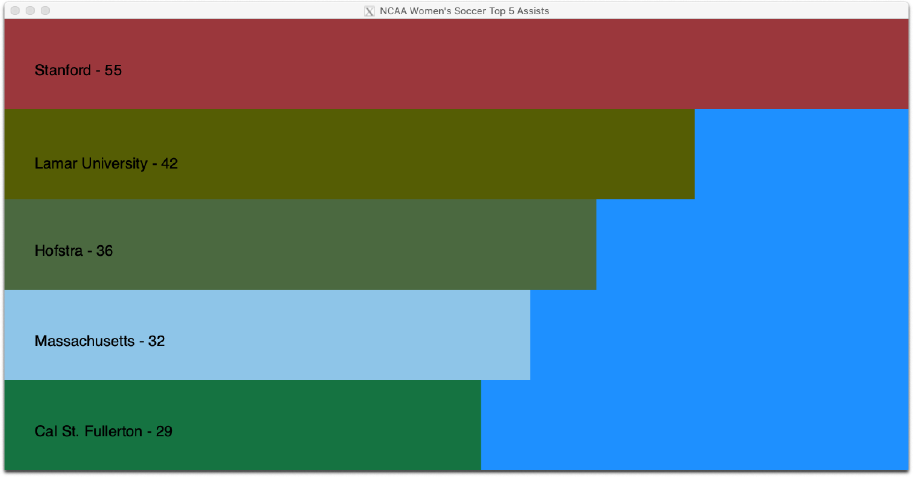
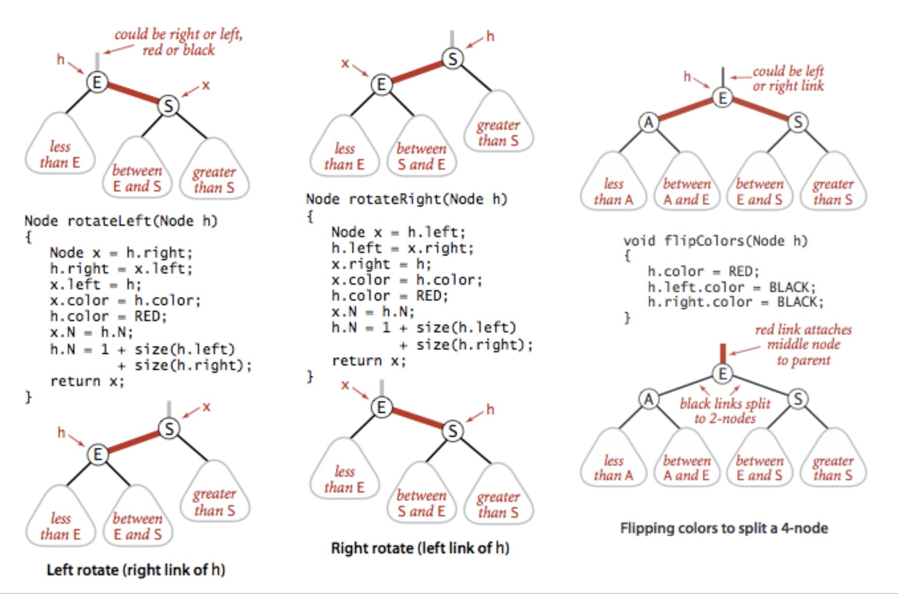
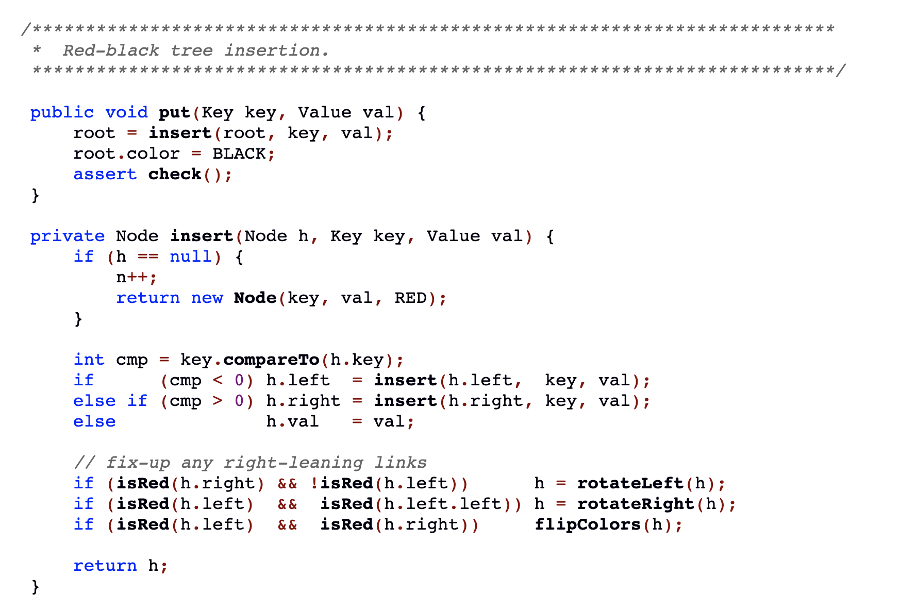

#  CSCI 1103 Computer Science 1 Honors

### Fall 2022

Robert Muller - Boston College

------

## Problem Set 5 : Assists or Balanced Trees

### 20 Points

### Due Wednesday October 26, 2022, Midnight

This is an individual problem set. 

There are two problems here. Students enrolled in CSCI 2103 are required to complete the Balanced Tree problem. Students enrolled in CSCI 1103 can choose either problem. **Requirement:** email the entire course staff to let them know which problem you've chosen.

---

## Problem 1: Computing and Displaying Assist Data from Women's NCAA Soccer

The problem involves writing an OCaml program to create a histogram showing the top 5 NCAA Women's soccer teams rated by the number of assists by their top ranking players. 



The input data (from the 2019 NCAA season) describes the top 150 players as ranked by assists. The data is contained in a text file in `assists.csv` (comma-separated-values) format. You'll be provided with harness code that reads the data into a list.

```
"Rank","Name","Team","Cl","Pos","Games","Assists","Per Game"
"1","Catarina Macario","Stanford","Jr.","-","25","23","0.92"
"2","Lucy Ashworth","Lamar University","Jr.","F","23","17","0.74"
"3","Jimena Lopez","Texas A&M","Jr.","M","21","15","0.71"
"4","Angela Caloia","Harvard","Fr.","F","16","11","0.69"
"5","Kiersten Edlund","Troy","Sr.","M","19","13","0.68"
"6","Stasia Mallin","Memphis","Sr.","D","21","14","0.67"
"7","Abby Jones","Murray St.","So.","-","17","11","0.65"
"8","Ansley Frazier","Massachusetts","Fr.","M","19","12","0.63"
"9","Keeley Leising","Winthrop","Sr.","D","16","10","0.63"
"9","Ashley Sanchez","UCLA","Jr.","F","24","15","0.63"
"11","Atlanta Primus","Cal St. Fullerton","Sr.","M","21","13","0.62"
...
```

Your code is required to process the data in the list and then produce a horizontal histogram, showing the top 5 teams ranked by assists.

##### How to Run the Code

```bash
> cd src
> dune exec bin/main.exe assists.csv
```

##### What you Need to Do

This application is not one that involves the repetitive behavior of the `Animate.start` function. You are required to write the `view` function which will be called just once: when the `Animate.start` loop exits. The `view`  function is of type `model -> Image.t`, where a `model` is a `player list`. The model will look like this:

```ocaml
[ { rank = 1
  ; name = "Catarina Macario"
  ; team = "Stanford"
  ; cls = "Jr."
  ; pos = "-"
  ; games = 25
  ; assists = 23
  ; pergame = 0.92
  } ;
  { rank = 2
  ; name = "Lucy Ashworth"
  ; ...
  } ;
  ...
]
```

You'll need to add up the assists for all players from a given school and then sort the schools in descending order. Then select the top 5 for rendering in the histogram. Of course, each bar in the histogram is just an `Image.rectangle`, with an `Image.text` label, a height 1/5 of the `displayHeight` and a width proportional to the width of the top-ranked team.

The `List.filter` function might come in handy for this problem set.

---

## Problem 2: Implementing Immutable Left-Leaning Red/Black Trees

Dictionaries are perhaps the most common data structure in computing. For small applications, something simple like an association list will do.

```ocaml
[ {key="Martha"; value=30}; {key="Tianrui"; value=40}; ... ]
```

For large dictionaries the linear cost of the `find` operation for this data structure may not be acceptable. When the keys are ordered (i.e., they can be compared to one another), the dictionary can be represented as a [binary search tree](https://en.wikipedia.org/wiki/Binary_search_tree). The following code implements the main BST operations (`put` and `find`) in an **immutable** binary search tree.

```ocaml
(* Simple Binary Search Trees *)
type key = string
type 'a dictionary = Empty
                   | Node of { key   : key
                             ; value : 'a
                             ; left  : 'a dictionary
                             ; right : 'a dictionary
                             }
                             
(* put : key -> value -> 'a dictionary -> 'a dictionary *)
let rec put newKey newValue diction =
  match diction with
  | Empty -> Node {key=newKey; value=newValue; left=Empty; right=Empty}
  | Node {key; value; left; right} ->
    (match compare newKey key with 
     |  0 -> Node {key; value = newValue; left; right}
     | -1 -> Node {key; value; left = put newKey newValue left; right}
     |  1 -> Node {key; value; left; right = put newKey newValue right})
     
(* find : key -> 'a dictionary -> 'a *)
let rec find searchKey diction =
  match diction with
  | Empty -> failwith "key not found"
  | Node {key; value; left; right} ->
  	(match compare searchKey key with
  	 |  0 -> value
  	 | -1 -> find searchKey left
  	 |  1 -> find searchKey right)
```

> Note the use of the buillt-in `compare` function. When called as in `(compare a b)` it return -1 if a < b, 0 if a = b and +1 if a > b.

The binary search tree has reasonable algorithmic performance -- on average, both `find` and `put` require a number of steps logarithmic in the size of the dictionary. 

>  **Problem 1 (4 Points)**: Write a function `isBST : 'a dictionary -> bool` such that a call `(isBST tree)` returns `true` if `tree` is a well-formed binary search tree and `false` if it is not.

Unfortunately, this simple BST representation isn't immune to poor performance, if the keys are inserted in, say, sorted order, then the `find` and `put` operations revert to the linear case. I.e., the worst-case performance of BSTs is no better than that of a simple-minded list.

#### Balanced Binary Search Trees

The problem with simple BSTs is that they're prone to imbalance. The length of a path from the root of the tree to some leaves can be quite large. Enter the [balanced binary search tree](https://en.wikipedia.org/wiki/Self-balancing_binary_search_tree). There are many variations. The one considered here, the [left-leaning red-black tree](https://en.wikipedia.org/wiki/Left-leaning_red%E2%80%93black_tree#:~:text=A%20left%2Dleaning%20red%E2%80%93black,to%20be%20easier%20to%20implement.), was developed by Robert Sedgewick. See [Algorithms Section 3](https://algs4.cs.princeton.edu/33balanced/) for a detailed Java-based discussion.

The idea is that when a new key/value pair is put into the tree, some administrative steps are taken to ensure that the resulting tree remains balanced. Essential parts of the scheme are *colored tree links* and *rotations*. All tree links are either black or red. Rotations are re-arrangements of trees that preserve the binary search tree property: all keys on the left of a node are smaller than the key at the node, and all keys on the right of a node are larger than the key at the node.

In practice, it's more convenient to store the color of the link in the tree nodes rather than color the link itself. We might define the data structure as in

```ocaml
type color = Red | Black
type key = int
type 'a rbt = Empty
            | Node of { key   : key
                      ; color : color
                      ; value : 'a
                      ; left  : 'a rbt
                      ; right : 'a rbt
                      }
```

A left-leaning red/black tree can have any arrangement of red or black links, as long as they satisfy the following invariants:

1. There are no red right links;
2. There are no consecutive red links;
3. There are no nodes with two red links.

> **Problem 2 (4 Points): Write a function `isLLRBT : 'a llrbt -> bool` such that a call `(isLLRBT tree)` returns `true` if `tree` is a well-formed left-leaning red/black tree and `false` if it isn't.

The `find` operation for a left-leaning red/black tree is essentially identical to the `find` operation for an ordinary BST. The essential work for the left-leaning red/black tree is in the `put` operation. The above invariants can be preserved through the use of left and right rotations. The following is a snapshot from Sedgewick & Wayne's [Algorithms](https://algs4.cs.princeton.edu/home/) site. It shows how rotations can be performed for mutable left-leaning red/black trees.



The `rotateLeft`, `rotateRight` and  `flip` functions are used in the implementation of the `put` operation.



Note that both the order and the sequencing of the rotations and flip are essential. That is, a left rotation may trigger a subsequent right rotation and/or a flip.

##### Immutability

Although the above `put` function and its helper functions `rotateLeft`, `rotateRight` and  `flip` all *mutate* the binary tree in-place, the essential invariants defined above can otherwise be preserved when `put` and its three helper functions are defined without mutating the tree. I.e., for immutable left-leaning red-black trees.

> **Problem 3 (12 Points):** Implement the `put` operation for immutable, left-leaning red/black trees.

> **Extra Credit (5 Points)**: Implement the `delete : key -> 'a rbt -> 'a rbt` operation such that a call `(delete key tree)` returns a well-formed left-leaning red/black tree like `tree` but with the node containing `key` deleted. Immutably.

##### Submitting Your Work

When you're finished, `git add` and then `git commit` your work with the message `"Final: YOUR NAME"`. Then use `git push` as usual. Good luck!